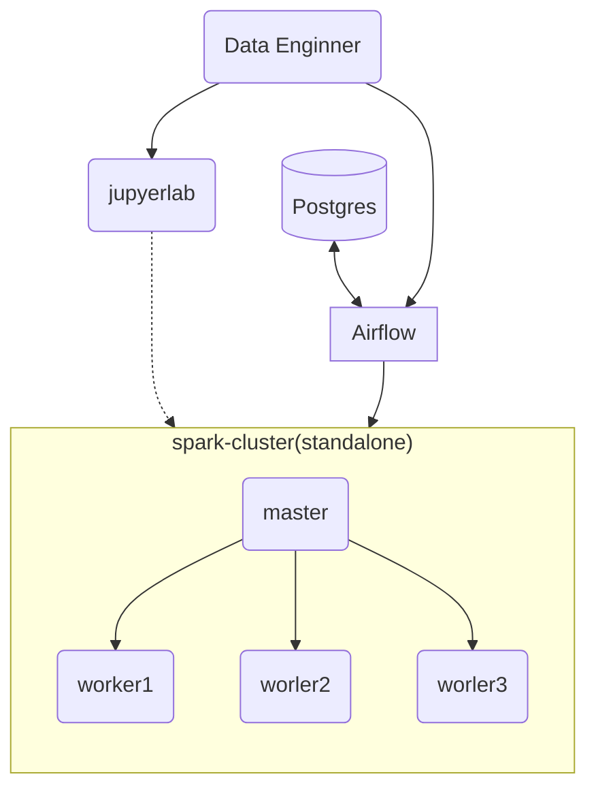

# docker-data-etl

This project is a data etl flow with airflow and spark:

A simple data etl flow extract news by web crawler, use jieba to cut the words, load the data to postgres

- architecture


### build image

- use `build.sh`

`bash build.sh {image_name}`

- `Makefile`

``make build-all``

* get started with docker compose

```docker-compose up -d```


### Service

- [airflow](http://0.0.0.0:/8282)
- [spark](http://0.0.0.0:8080)
- [jupyterlab](http://0.0.0.0:8888)

## Reference

https://medium.com/data-arena/building-a-spark-and-airflow-development-environment-with-docker-f0b9b625edd8

https://github.com/cluster-apps-on-docker/spark-standalone-cluster-on-docker

https://hub.docker.com/r/bitnami/spark

https://github.com/puckel/docker-airflow

