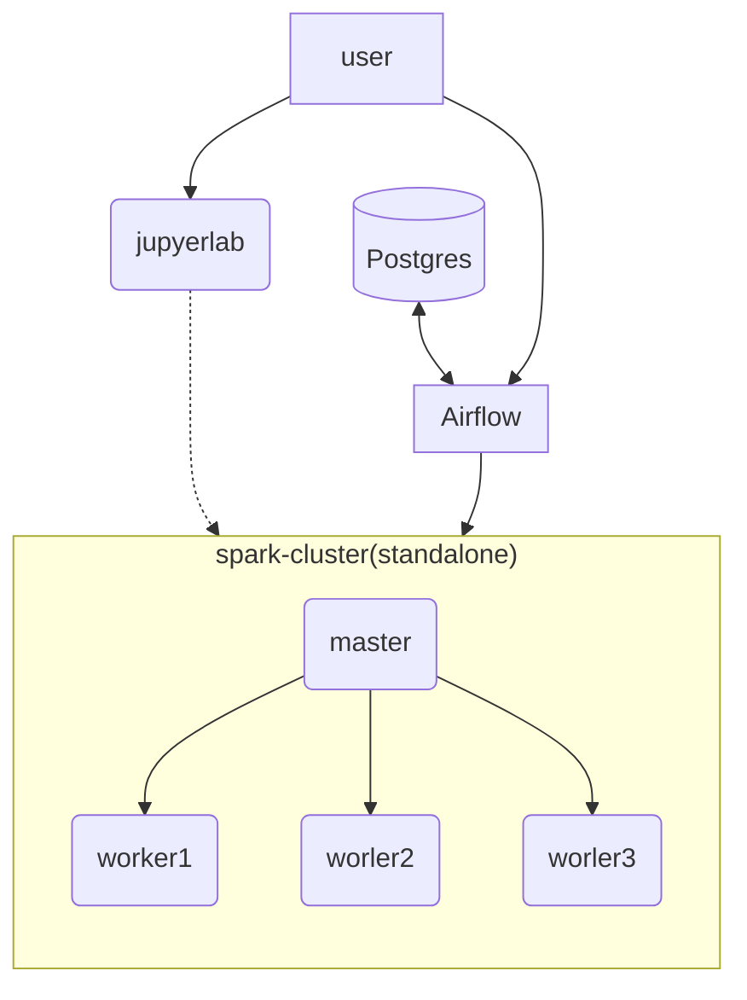

# docker-data-etl

This project is a data etl flow with airflow and spark:

A simple data etl flow extract news by web crawler, use jieba to cut the words, load the data to postgres

- architecture

* build image
`bash build.sh {image_name}`

* get started with docker compose
`docker-compose up -d`

## Note
  
  This project is modified from https://github.com/pappas999/chainlink-hardhat-box

