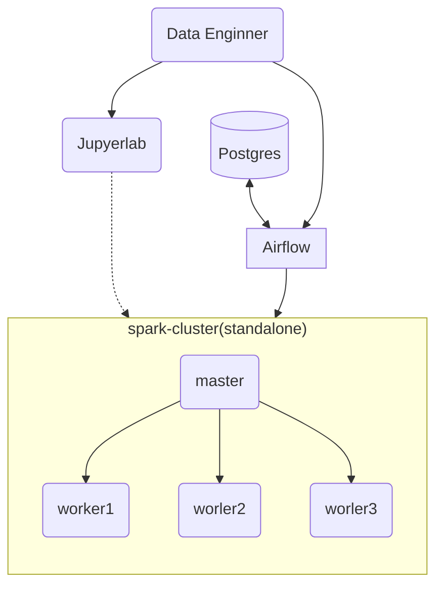

# docker-data-etl

This project is a data etl flow with airflow and spark:

A lightweight data etl flow extract news by web crawler, use jieba to cut the words, load the data to postgres

### architecture

```mermaid
flowchart

    user("Data Enginner")
    
    
    master("master")
    worker1("worker1")
    worker2("worler2")
    worker3("worler3")
    
    db[("Postgres")]
    notebook("Jupyerlab")
    
    user

    subgraph spark-cluster["spark-cluster(standalone)"]
    
        direction TB
        master --> worker1 
        master --> worker2 
        master --> worker3

    end
    
    subgraph airflow ["Airflow"]
    
        
    
    end
    
    db <--> airflow
    
    user --> airflow
    user --> notebook
    
    notebook -..-> spark-cluster
    airflow--> spark-cluster
    
```

### Build Images

Build all images:
```bash
make build-all
```

Or build specific images:
```bash
make build-base          # Base Python image
make build-spark-base    # Spark base image
make build-spark-master  # Spark master
make build-spark-worker  # Spark workers
make build-airflow       # Airflow
make build-notebook      # JupyterLab
make build-postgres      # PostgreSQL
```

### Quick Start

**Option 1: Complete Setup (Recommended)**

Start all services and configure connections automatically:
```bash
make start
```

**Option 2: Manual Setup**

Start services only:
```bash
make up
```

Then configure connections:
```bash
make setup-connections
```

### Common Commands

```bash
make status    # Show service status
make logs      # View logs (Ctrl+C to exit)
make restart   # Restart all services
make down      # Stop all services
make help      # Show all available commands
```


### Service

- [airflow](http://0.0.0.0:/8282)
- [spark](http://0.0.0.0:8080)
- [jupyterlab](http://0.0.0.0:8888)


### Airflow connection

#### Option 1: Automated Setup (Recommended)

Run the setup script after starting all containers:

```bash
bash scripts/setup-airflow-connections.sh
```

This script will automatically configure:
- Spark connection (`spark_default`)
- PostgreSQL connection (`postgres_default`)


#### Option 2: Manual Setup via Web UI

1. Open Airflow UI: http://localhost:8282
2. Navigate to `Admin` → `Connections`
3. Click `+` to add new connection

**Spark Connection Settings:**
- Connection Id: `spark_default`
- Connection Type: `Spark`
- Host: `spark://spark-master`
- Port: `7077`
- Extra: `{"queue": "root.default", "deploy-mode": "client"}`


**PostgreSQL Connection Settings:**
- Connection Id: `postgres_default`
- Connection Type: `Postgres`
- Host: `postgres`
- Schema: `airflow`
- Login: `airflow`
- Password: `airflow`
- Port: `5432`


#### Verify Connections

```bash
docker exec -it data-etl-airflow airflow connections list
```


### ETL


- extract: web crawler
- transformation: wordcount using spark
- load: spark write data to postgres


## Reference


https://medium.com/data-arena/building-a-spark-and-airflow-development-environment-with-docker-f0b9b625edd8

https://github.com/cluster-apps-on-docker/spark-standalone-cluster-on-docker

https://hub.docker.com/r/bitnami/spark

https://github.com/puckel/docker-airflow

https://medium.com/ava-information/airflow-2-0-docker-development-setup-docker-compose-postgresql-7911f553b42b

