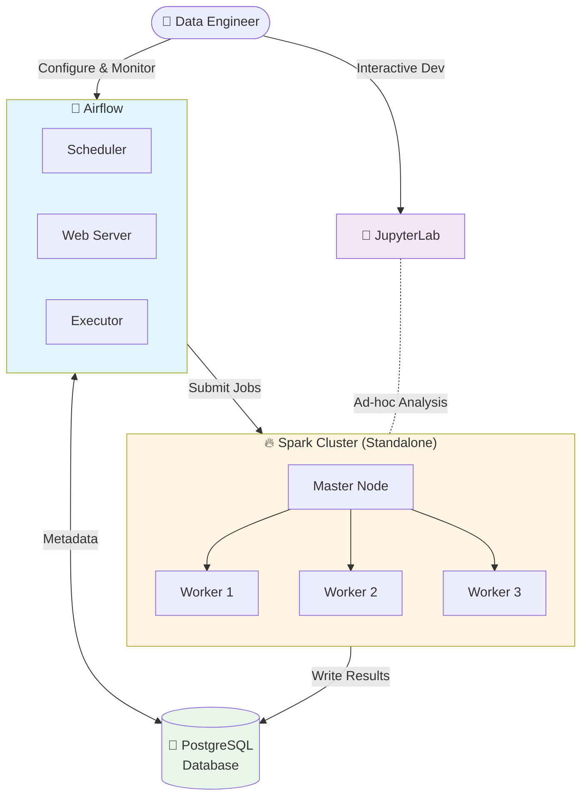
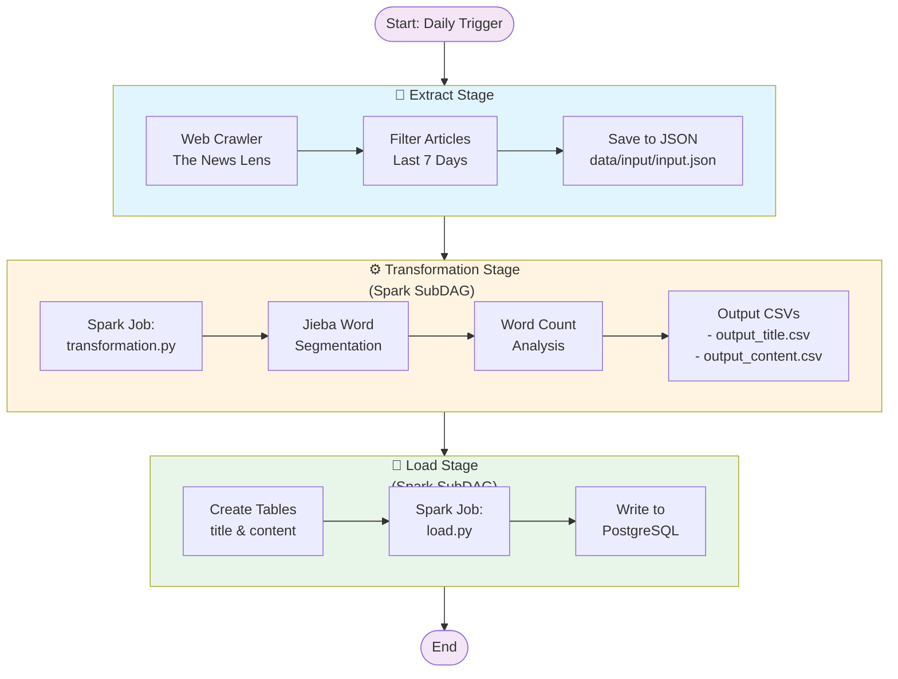

# Docker Data ETL Platform

A lightweight ETL platform that extracts news articles via web crawler, performs Chinese word segmentation using jieba, and loads processed data into PostgreSQL. Built with Airflow for orchestration and Spark for distributed data processing.

## Architecture


```mermaid
flowchart TB
    user([👤 Data Engineer])

    subgraph spark["🔥 Spark Cluster (Standalone)"]
        direction TB
        master[Master Node]
        worker1[Worker 1]
        worker2[Worker 2]
        worker3[Worker 3]
        master --> worker1
        master --> worker2
        master --> worker3
    end

    subgraph airflow["🌊 Airflow"]
        scheduler[Scheduler]
        webserver[Web Server]
        executor[Executor]
    end

    db[(🐘 PostgreSQL<br/>Database)]
    notebook[📓 JupyterLab]

    user --> |Configure & Monitor| airflow
    user --> |Interactive Dev| notebook

    airflow <--> |Metadata| db
    airflow --> |Submit Jobs| spark
    notebook -.- |Ad-hoc Analysis| spark
    spark --> |Write Results| db

    style spark fill:#fff4e1
    style airflow fill:#e1f5ff
    style db fill:#e8f5e9
    style notebook fill:#f3e5f5
```

## Getting Started

### Build Images

Build all images:
```bash
make build-all
```

Or build specific images:
```bash
make build-base          # Base Python image
make build-spark-base    # Spark base image
make build-spark-master  # Spark master
make build-spark-worker  # Spark workers
make build-airflow       # Airflow
make build-notebook      # JupyterLab
make build-postgres      # PostgreSQL
```

### Quick Start

**Option 1: Complete Setup (Recommended)**

Start all services and configure connections automatically:
```bash
make start
```

**Option 2: Manual Setup**

Start services only:
```bash
make up
```

Then configure connections:
```bash
make setup-connections
```

### Common Commands

```bash
make status    # Show service status
make logs      # View logs (Ctrl+C to exit)
make restart   # Restart all services
make down      # Stop all services
make help      # Show all available commands
```


### Service Endpoints

After starting the services, you can access:

| Service | URL | Description |
|---------|-----|-------------|
| Airflow Web UI | http://localhost:8282 | Monitor and manage ETL workflows |
| Spark Master UI | http://localhost:8080 | Monitor Spark cluster and jobs |
| JupyterLab | http://localhost:8888 | Interactive development environment |
| PostgreSQL | localhost:5432 | Database (user: airflow, password: airflow) |

### Airflow Connection Setup

#### Option 1: Automated Setup (Recommended)

Run the setup script after starting all containers:

```bash
bash scripts/setup-airflow-connections.sh
```

This script will automatically configure:
- Spark connection (`spark_default`)
- PostgreSQL connection (`postgres_default`)


#### Option 2: Manual Setup via Web UI

1. Open Airflow UI: http://localhost:8282
2. Navigate to `Admin` → `Connections`
3. Click `+` to add new connection

**Spark Connection Settings:**
- Connection Id: `spark_default`
- Connection Type: `Spark`
- Host: `spark://spark-master`
- Port: `7077`
- Extra: `{"queue": "root.default", "deploy-mode": "client"}`


**PostgreSQL Connection Settings:**
- Connection Id: `postgres_default`
- Connection Type: `Postgres`
- Host: `postgres`
- Schema: `airflow`
- Login: `airflow`
- Password: `airflow`
- Port: `5432`


#### Verify Connections

```bash
docker exec -it data-etl-airflow airflow connections list
```


## ETL Pipeline Flow

The daily ETL workflow processes news articles through three sequential stages:


```mermaid
flowchart TD
    Start([Start: Daily Trigger]) --> Extract

    subgraph Extract["📰 Extract Stage"]
        E1[Web Crawler<br/>The News Lens]
        E2[Filter Articles<br/>Last 7 Days]
        E3[Save to JSON<br/>data/input/input.json]
        E1 --> E2 --> E3
    end

    subgraph Transform["⚙️ Transformation Stage<br/>(Spark SubDAG)"]
        T1[Spark Job:<br/>transformation.py]
        T2[Jieba Word<br/>Segmentation]
        T3[Word Count<br/>Analysis]
        T4[Output CSVs<br/>- output_title.csv<br/>- output_content.csv]
        T1 --> T2 --> T3 --> T4
    end

    subgraph Load["💾 Load Stage<br/>(Spark SubDAG)"]
        L1[Create Tables<br/>title & content]
        L2[Spark Job:<br/>load.py]
        L3[Write to<br/>PostgreSQL]
        L1 --> L2 --> L3
    end

    Extract --> Transform
    Transform --> Load
    Load --> End([End])

    style Extract fill:#e1f5ff
    style Transform fill:#fff4e1
    style Load fill:#e8f5e9
    style Start fill:#f3e5f5
    style End fill:#f3e5f5
```

### Pipeline Components

- **Extract**: Web crawler scrapes news articles from The News Lens politics section
- **Transformation**: Spark job performs Chinese word segmentation using jieba and calculates word frequencies
- **Load**: Spark job writes processed data to PostgreSQL database


## References

This project was inspired by and built upon the following resources:

- [Building a Spark and Airflow Development Environment with Docker](https://medium.com/data-arena/building-a-spark-and-airflow-development-environment-with-docker-f0b9b625edd8)
- [Spark Standalone Cluster on Docker](https://github.com/cluster-apps-on-docker/spark-standalone-cluster-on-docker)
- [Bitnami Spark Docker Image](https://hub.docker.com/r/bitnami/spark)
- [Docker Airflow](https://github.com/puckel/docker-airflow)
- [Airflow 2.0 Docker Development Setup](https://medium.com/ava-information/airflow-2-0-docker-development-setup-docker-compose-postgresql-7911f553b42b)

## License

MIT

